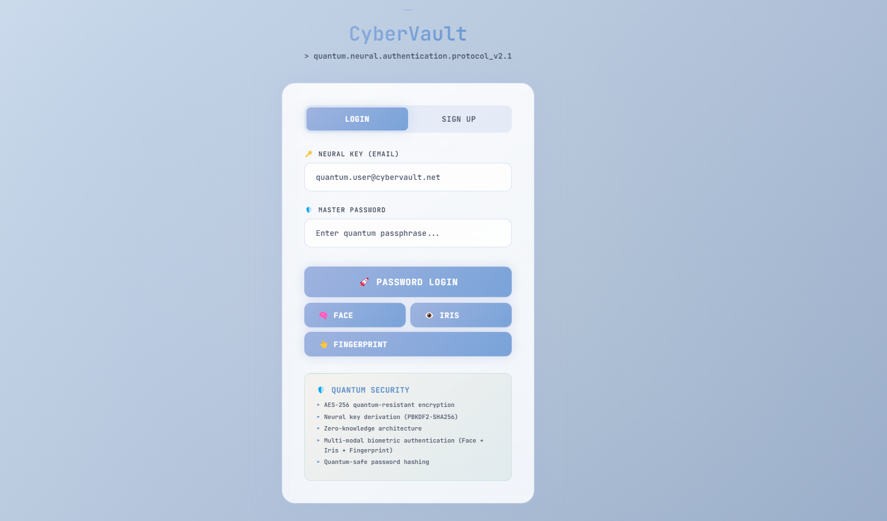
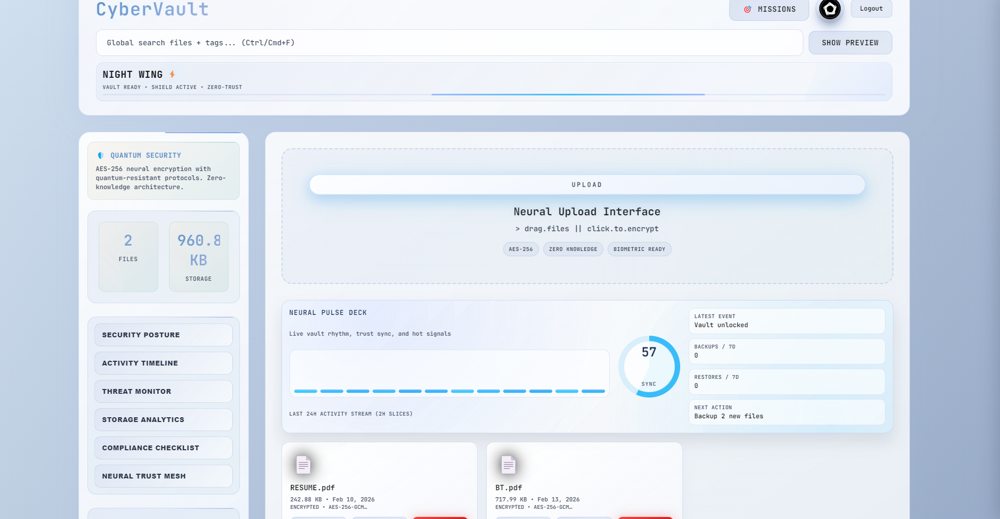
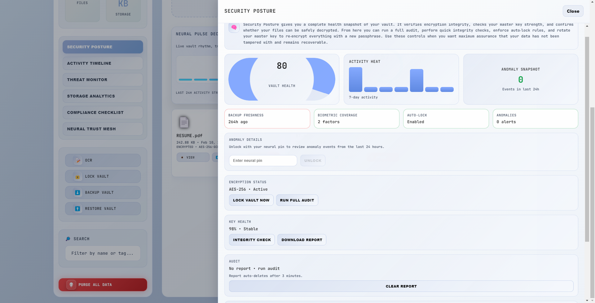
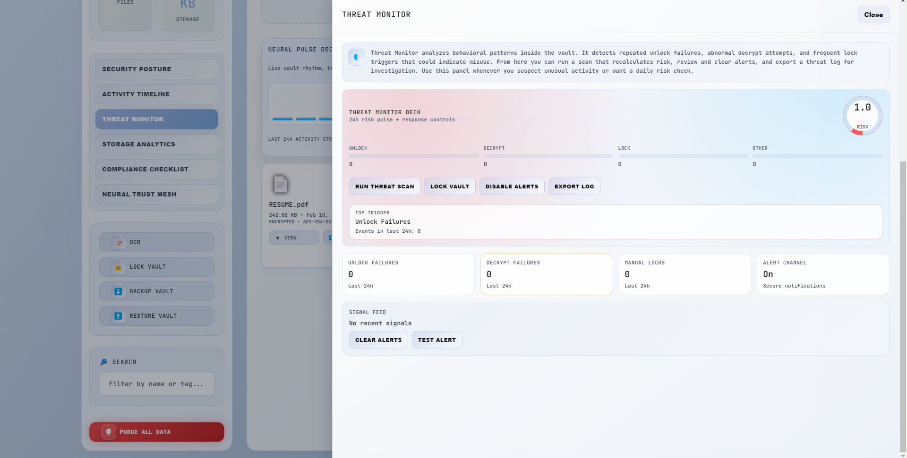
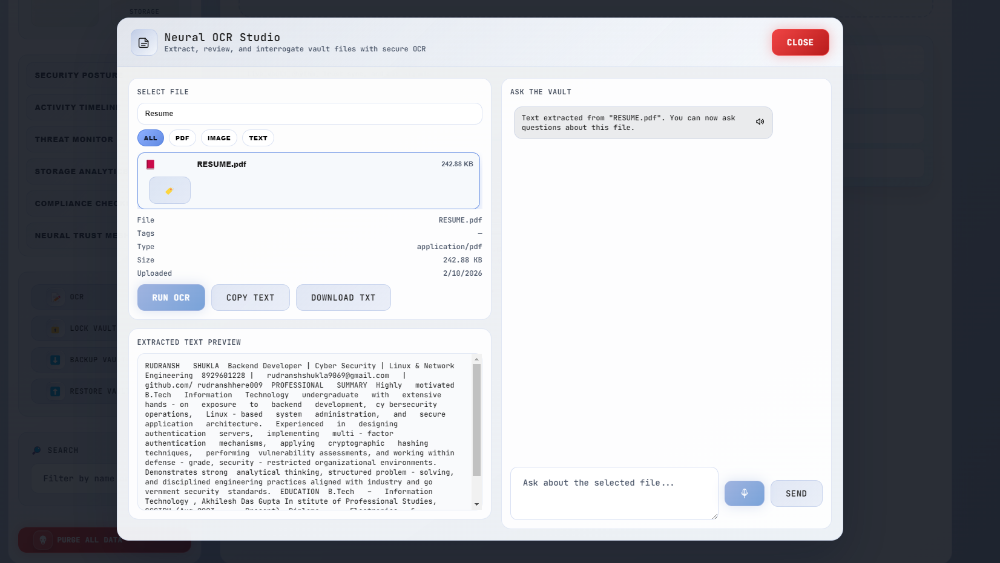

# Cyber - Vault

CyberVault is a local-first desktop vault built with Electron + React for encrypting, organizing, auditing, and restoring sensitive files on-device.

This README is intentionally detailed so maintainers and contributors can quickly understand what exists today, how it works, and how to operate it safely.

## Quick Start (2 min)

1. Open terminal in `cybervault-electron-react`.
2. Install dependencies:

```bash
npm install
```

3. Start development mode:

```bash
npm run dev
```

4. In app flow:
- Create account (email/password + neural PIN).
- Register face + iris (fingerprint optional).
- Upload a file and encrypt.
- Run one backup snapshot from sidebar.

## Table of Contents

- [Quick Start (2 min)](#quick-start-2-min)
- [Project Snapshot](#project-snapshot)
- [What Is Implemented](#what-is-implemented)
- [Feature Matrix](#feature-matrix)
- [Security Model](#security-model)
- [Tech Stack](#tech-stack)
- [Architecture](#architecture)
- [Data Storage Layout](#data-storage-layout)
- [Authentication and Identity Flows](#authentication-and-identity-flows)
- [Vault Workflows](#vault-workflows)
- [OCR Assistant and AI Answering](#ocr-assistant-and-ai-answering)
- [Mission Mode](#mission-mode)
- [Compliance and Monitoring Panels](#compliance-and-monitoring-panels)
- [Screenshots](#screenshots)
- [Installation and Setup](#installation-and-setup)
- [Run and Build Commands](#run-and-build-commands)
- [Environment Variables](#environment-variables)
- [Project Structure](#project-structure)
- [Troubleshooting](#troubleshooting)
- [Known Gaps and Hardening Opportunities](#known-gaps-and-hardening-opportunities)
- [Release Notes](#release-notes)
- [Contributing Notes](#contributing-notes)
- [License](#license)

## Project Snapshot

CyberVault currently provides:

- Local encrypted file vault.
- Password + PIN + biometric access patterns.
- AES-256-GCM encryption/decryption with checksum verification.
- Backup and restore workflows.
- Audit and threat monitoring dashboards.
- OCR text extraction and optional AI-assisted Q&A.
- Mission workflows and challenge/badge mechanics.

## What Is Implemented

### Core vault and crypto

- File encryption using `crypto.subtle.encrypt` with `AES-GCM`.
- Key derivation with `PBKDF2-SHA256` (250,000 iterations).
- File integrity checks with `SHA-256` checksums.
- Per-file metadata and encrypted payload persistence.
- Key rotation flow to re-encrypt vault data with a new master key.

### Identity and access

- Email/password login and signup flow.
- Face biometric registration and login.
- Iris biometric registration and login.
- Fingerprint authentication using WebAuthn and platform authenticators.
- Neural PIN checks for sensitive/unlock actions.
- Session persistence with timeout/auto-lock behaviors.

### Operational features

- Backup export (`.cybvlt`) and encrypted restore.
- Activity timeline and event filtering/export.
- Security posture scoring panel.
- Threat monitor with 24h event summaries and risk scoring.
- Audit report export (JSON and PDF).
- Threat log export.

### File intelligence

- OCR extraction from image files via Tesseract.
- PDF text extraction via pdf.js and OCR fallback for scanned PDFs.
- Text file extraction.
- File Q&A assistant with local heuristics.
- Optional OpenAI-backed answer generation over extracted text.

### UX and profile features

- Profile editor and avatar crop/save flow.
- Recovery code generation, copy, and regeneration.
- Search, file preview, export format recommendations.
- Drag-and-drop upload and import interactions.
- Mission Mode workflows and gamified challenges.

## Feature Matrix

| Capability | Status | Notes |
| --- | --- | --- |
| Local encrypted vault | Implemented | AES-GCM + PBKDF2-derived key |
| Per-file integrity verification | Implemented | SHA-256 checksum comparisons |
| Face authentication | Implemented | face-api.js descriptor matching |
| Iris authentication | Implemented | Custom template sampling/comparison |
| Fingerprint authentication | Implemented | WebAuthn + platform authenticators |
| Encrypted backup export | Implemented | `.cybvlt` output |
| Backup restore | Implemented | Decrypt + restore metadata/payload mapping |
| OCR extraction | Implemented | Tesseract + pdf.js integration |
| AI Q&A over OCR text | Implemented (optional) | Requires OpenAI env vars |
| Audit report JSON/PDF export | Implemented | Electron save dialog + PDF print |
| Threat monitor + export | Implemented | Risk score + threat log |
| Cross-platform packaging | Partial | Windows target configured in `electron-builder` |

## Security Model

CyberVault is designed as a local-first vault with explicit tradeoffs:

- Encryption and decryption happen on-device.
- Master password is used for key derivation.
- Sensitive operations require valid derived keys and integrity checks.
- Biometric flows provide convenience access factors.
- Threat and audit panels help detect operational misuse patterns.

Important current behavior:

- WebAuthn credential store persistence exists, but at-rest hardening for that store is a known improvement area.
- Face models are currently loaded from external URLs at runtime.
- Optional AI answering sends extracted text context to OpenAI only when configured.

## Tech Stack

### Desktop and UI

- Electron 30
- React 18
- Vite 5
- CSS modules/stylesheets (plain CSS)

### Crypto and identity

- Web Crypto API (`AES-GCM`, `PBKDF2`, `SHA-256`)
- WebAuthn / PublicKeyCredential APIs
- `uuid`

### Biometrics and analysis

- face-api.js (runtime CDN load)
- Custom iris detection utility
- Tesseract.js
- pdf.js (`pdfjs-dist`)

### Packaging/tooling

- electron-builder (Windows NSIS target)
- concurrently
- wait-on
- cross-env
- dotenv

## Architecture

High-level layering:

1. Renderer (`React`) handles UI, crypto operations, user workflows.
2. Preload (`preload.cjs`) exposes restricted IPC bridge methods.
3. Main process (`electron/main.js`) handles file persistence and export dialogs.
4. Persistent stores combine IndexedDB, localStorage, and Electron userData files.

### Renderer responsibilities

- Authentication orchestration.
- Encryption/decryption and integrity checks.
- Activity/threat/audit state management.
- OCR extraction and assistant interactions.

### Main process responsibilities

- Read/write credential store.
- Read/write vault index and app state.
- Read/write/delete encrypted blob files.
- Save audit/threat/backup exports.
- Optional OpenAI API relay for OCR assistant answers.

## Data Storage Layout

CyberVault uses multiple local stores for reliability and compatibility.

### IndexedDB

- Encrypted file payload storage.
- Metadata store for supplemental indexed values.

### localStorage

- Session/profile values.
- Recovery codes.
- Threat/activity cache values.
- Fallback storage for dev modes where IPC is unavailable.

### Electron userData files

Typical files created via IPC:

- `cybervault_vault_index.json`
- `cybervault_app_state.json`
- `webauthn_credentials.json`
- `cybervault_blobs/<dataId>.bin`

## Authentication and Identity Flows

### Signup flow

1. User submits username/email/password and neural PIN.
2. Face registration captures descriptor samples.
3. Iris registration captures template samples.
4. Optional fingerprint registration via WebAuthn.
5. Profile and biometric capabilities are persisted.

### Login flow

- Password login supported.
- Face login supported.
- Iris login supported.
- Fingerprint login supported if previously registered.

### Unlock flow (when locked)

- Master password unlock.
- Face unlock.
- Iris unlock.
- Fingerprint unlock.

## Vault Workflows

### File ingest

1. Upload or drag file.
2. Derive encryption key from master password + salt.
3. Encrypt payload with AES-GCM + IV.
4. Compute checksum.
5. Persist payload + metadata.

### File view/decrypt

1. Resolve encrypted payload from IndexedDB/blob store.
2. Derive key and decrypt.
3. Verify checksum.
4. Render preview/export options.

### Backup export

1. Collect vault metadata snapshot.
2. Encrypt backup payload.
3. Save as `.cybvlt` via system dialog.

### Restore

1. Select backup file.
2. Provide restore key.
3. Decrypt and validate payload.
4. Rehydrate metadata and payload links.

## OCR Assistant and AI Answering

### Local extraction behavior

- Text files: decode directly.
- Images: OCR via Tesseract.
- PDFs: extract text via pdf.js; fallback OCR for scanned pages.

### Question answering behavior

- Local rule-based/section extraction fallback is available.
- If OpenAI env vars are set, assistant can request model-generated answers.

## Mission Mode

Mission Mode includes:

- Workflow actions (backup, integrity scan, report generation).
- Challenge actions (speed scan, tag master, encryption race, organizer goals).
- Badge persistence in vault index.

## Compliance and Monitoring Panels

The application includes operational panels for:

- Security posture overview.
- Threat monitor deck and risk indicators.
- Activity timeline with filters and export.
- Storage analytics and snapshot cues.
- Compliance checklist style indicators (GDPR/HIPAA/SOC2 UI tracking).

These panels are designed for operational awareness and lightweight evidence generation.

## Screenshots







## Installation and Setup

### Prerequisites

- Node.js 18+
- npm
- Camera permissions (for face/iris)
- Platform biometric support (for fingerprint)
- Windows is primary packaging target today

### Install

From `cybervault-electron-react`:

```bash
npm install
```

## Run and Build Commands

Run from `cybervault-electron-react`.

```bash
npm run dev
```

Starts Vite and Electron together for development.

```bash
npm run start
```

Starts Electron app entry directly.

```bash
npm run build:renderer
```

Builds renderer assets to `dist`.

```bash
npm run pack
```

Creates unpacked Electron build output.

```bash
npm run dist
```

Builds renderer and generates installer/distributables.

## Environment Variables

Used by optional OCR assistant AI answering (`electron/main.js`):

- `OPENAI_API_KEY`
- `OPENAI_MODEL` (default `gpt-4o-mini`)
- `OPENAI_PROJECT` (optional)
- `OPENAI_ORG` (optional)

Optional dev variable:

- `VITE_DEV_SERVER_URL` (overrides default `http://localhost:5173` in dev Electron bootstrap)

## Project Structure

```text
Cyber-Vault-main/
  README.md
  QUICK_TEST.md
  cybervault-electron-react/
    README.md
    QUICK_TEST.md
    package.json
    electron/
      main.js
      preload.cjs
    src/
      main.jsx
      modules/
        App.jsx
      components/
        Chatbot.jsx
        FingerprintAuth.jsx
        IrisModal.jsx
        MissionMode.jsx
        FileViewer.jsx
      utils/
        irisDetection.js
        webauthn-storage.js
        encryption.js
      styles/
        global.css
        matrix-theme.css
```

## Troubleshooting

### Fingerprint registration/authentication fails

- Ensure device/browser supports WebAuthn.
- Ensure platform authenticator is configured (Windows Hello / Touch ID).
- Verify secure context behavior in Electron dev flow.
- See `QUICK_TEST.md` for expected registration sequence.

### Face or iris flow does not detect

- Confirm camera permissions.
- Improve lighting and keep subject centered.
- Avoid glare and abrupt movement during sample capture.

### OCR results are empty or poor

- For scanned PDFs, ensure pages are readable and high contrast.
- For images, use higher resolution sources.
- Verify decrypted payload integrity before OCR attempts.

### AI answers unavailable

- Configure `OPENAI_API_KEY`.
- Check network availability.
- Validate `OPENAI_MODEL` value.

### Backup restore fails

- Confirm correct restore key.
- Confirm backup file is not truncated/corrupted.
- Verify file follows expected backup object shape.

## Known Gaps and Hardening Opportunities

- Strengthen at-rest protection for persisted WebAuthn credential store.
- Bundle face model assets for fully offline biometric operation.
- Add stronger anti-spoofing and higher-confidence biometric checks.
- Expand platform packaging/signing and release automation.
- Add automated integration tests for backup/restore and threat/audit workflows.
- Introduce secure secret handling patterns beyond env file usage.

## Release Notes

### 2026-02-13

- Expanded README into a full technical reference with architecture, flows, and operations.
- Added Quick Start section for first-time setup.
- Added screenshot conventions and markdown embedding guide.
- Added troubleshooting and hardening roadmap sections.
- Synced documentation at root and app-level README.

## Contributing Notes

When changing behavior, update both README copies:

- `README.md`
- `cybervault-electron-react/README.md`

Recommended contributor checks:

1. Run app in dev mode and verify primary flows.
2. Validate biometric fallbacks and error states.
3. Validate backup/restore integrity with sample files.
4. Validate OCR extraction on text, image, and PDF files.
5. Keep docs aligned with actual code paths and dependencies.

## License

MIT
